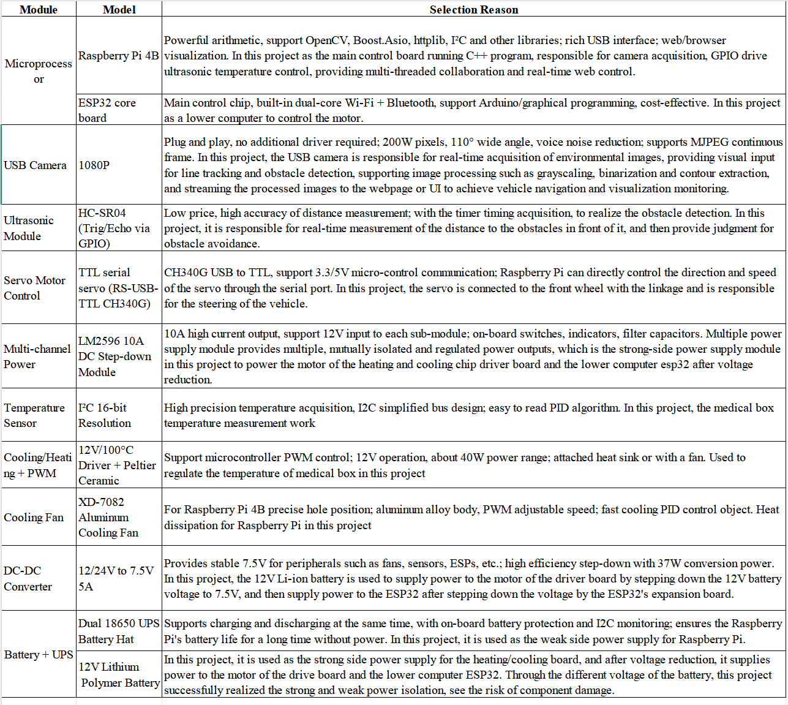

# Autonomous Hospital Vehicle for Line-Following and Medical Cargo transport
## 1. Introduction
With the rise of smart healthcare and intelligent hospitals, Automated Guided Vehicles (AGVs) have become a key part of modern medical logistics. Traditional manual transport is inefficient and error-prone, while AGVs enable the automatic and precise delivery of items such as medications, samples, and meals, easing staff workload and improving efficiency. To operate effectively in hospital environments, AGVs must ensure stable navigation, real-time obstacle avoidance, and temperature control. They often rely on black line tracking for navigation, ultrasonic sensors for safety, and onboard temperature regulation to protect sensitive medical items like vaccines or specimens.

This project presents the design and implementation of a Raspberry Pi-based intelligent vehicle control system tailored to medical AGV applications. The system is developed in C++ and integrates multiple functionalities including line following, ultrasonic obstacle avoidance, temperature monitoring and control, and lightweight web-based communication. OpenCV is used for real-time image acquisition and processing, while the path center is extracted using image moment calculations. A proportional control algorithm dynamically adjusts the servo angle, enabling the vehicle to follow a black line with high precision. An ultrasonic distance sensor, connected via GPIO, allows the system to detect obstacles in front of the vehicle and initiate appropriate avoidance maneuvers to prevent collisions. For temperature-sensitive transport, the system incorporates an I2C-based digital temperature sensor and uses a PID algorithm to control a cooling or heating module via PWM signals, ensuring stable cargo temperatures. On the communication side, an embedded HTTP server provides a live video stream and RESTful APIs, allowing users to monitor the vehicle’s status, adjust parameters, and control operation remotely through a browser interface.

  

Figure 1: Demo of AGV Model

## 2. Hardware and Component Selection

  

Figure 2: Raspberry Pi 4B+ main control board

  

Figure 3: ESP core board

## 3. System overall structure and operation logic
## 3.1 Software Architecture
Multithreading + asynchronous framework

· capture_frames(): responsible for the main logic of servo/tracking/obstacle avoidance, timing (30ms) trigger processing

· get_distance(): Ultrasonic distance measurement, timed (100ms) to update the global variable distance

· temp_control(): PID temperature control, timing (200ms) to drive Peltier and cooling fan

· HTTP Server (cpp-httplib)

· Static resources: front-end HTML/JS/CSS

## 3.2 Logical Flow

  

Figure 4: flow chart

## 4. System functions and implementation
## 4.1 Vehicle operation
The vehicle forward, stop, left turn, right turn four functions:

1）Forward section: This function enables the cart to run in a forward state. By controlling the angle direction of the servos of the two wheels, the wheels are rotated in different directions to realize forward running. The servo #008 is set to 2000 and #009 is set to 1000, and the left and right wheels are driven at different speeds to form a straightforward effect.

2）Stop section: This function controls the stopping of the vehicle. Servo #008 and #009 are simultaneously set to the neutral position 1500, which represents no torque output from the servo (i.e., the motor is stationary), thus stopping the wheels from rotating and the vehicle from moving.

3）Left turn: This function controls the steering servo to turn the vehicle to the left. Servo number #010 is set to 1000, which corresponds to a left-handed steering angle. This servo is typically connected to the steering wheel system or steering bridge mechanism and serves to control the angle of rotation of the front wheels.

4）Right turn: This function sets servo #010 to position 2000 to turn the car to the right. This is the opposite of car_turn_left(). By adjusting the servo control signal, precise directional control can be realized.

The control command string is sent to the servo controller via the serial port (serialFd), and once successfully transmitted, the servo executes the corresponding action immediately.

## 4.2 Visual System
Image processing algorithm - first convert the color frame to grayscale, then binarize the grayscale image with a threshold of 50 (black lines are mapped to white, and the background is blackened), then use the 3×3 rectangular structure element to perform "open operations" to remove small noise points, and then "close operations" to connect broken lines, and finally use findContours() to extract the largest area contour and filter out the target trajectory with an area greater than 100 pixels. If the contour is detected, calculate the center of gravity, generate a servo command through PID and send it through the serial port, draw the center line and update latest_frame; if not detected, directly copy the original frame; execute right turn and record time in obstacle avoidance state; only update the screen in stop state.

## 4.3 Track
This module performs image acquisition and preprocessing using OpenCV, and identifies the center of the trajectory based on image moment analysis. A proportional control algorithm is then applied to dynamically adjust the steering angle of the vehicle, enabling stable tracking of the path center. Additionally, a centerline visualization feature is provided to facilitate debugging and parameter tuning. This approach ensures both control accuracy and real-time responsiveness, offering strong support for reliable and robust line-following performance.

This module is centered around the image moment method. The getLineCenter function extracts the centroid of the black trajectory region in a binary image as a reference for vehicle navigation. It utilizes OpenCV's cv::moments() function to obtain the zero-order moment m00 and the first-order moments m10 and m01, and then calculates the centroid coordinates using the formulas x = m10/m00 and y = m01/m00. If no foreground pixels are detected (m00 = 0), the function returns a default coordinate (0, 0) to avoid division-by-zero errors. The generateControlCommand function then takes the horizontal deviation of the centroid as input and applies a proportional control strategy with a gain of Kp = 1.5625 to compute the steering PWM value. The output is clipped to the range [1000, 2000], and when the error is within ±5 pixels, a neutral PWM value of 1500 is returned while the integral term is reset to avoid error accumulation. For better visualization, the findCenterlinePoints function scans each row within the trajectory region to extract the horizontal centroid of black pixels, forming a set of centerline points. These are then rendered onto the original color image by the drawCenterlineOnColorImage function as green polyline segments with a thickness of 2 pixels. This visualization imposes minimal computational load but greatly enhances debugging efficiency and parameter verification.

## 4.4 Ultrasonic ranging
This module uses an HC-SR04 ultrasonic sensor to measure the distance between the smart car and nearby obstacles. It calculates the time-of-flight of an ultrasonic pulse using GPIO pins, and periodically updates the distance reading using Boost.Asio's asynchronous timer, without blocking the main thread.

1）How It Works (Principle)
Pulse Triggering:
An ultrasonic sensor (such as HC-SR04) emits a high-frequency sound wave using a brief electrical pulse.

Echo Reception:
The sound wave travels through the air, reflects off the nearest object, and returns to the sensor.

Time-of-Flight Measurement:
The system records how long the echo took to return. This is known as the "time-of-flight."

Distance Calculation:
Using the speed of sound (approximately 343 m/s), the system calculates the distance to the object with the formula:
Distance (cm) = Time(μs) * 0.0343 / 2

The division by 2 accounts for the round trip (forward and back).

2）How It's Timed: Boost.Asio

To keep the system efficient and non-blocking, a software timer is used:

Boost.Asio (a C++ asynchronous I/O library) is used to create a timer that runs every 100 milliseconds.

Every time the timer fires, the system automatically performs a new distance measurement.

This happens in the background, allowing the rest of the system (like camera processing or motor control) to continue running smoothly.

## 4.5 Obstacle Avoidance
In the visual line patrol module, each time the timer_handler is triggered, the program reads a frame of color image. If the car is in the running state, it first checks whether it is in the obstacle avoidance steering substate: through the recorded turn_start_time and the current steady_clock time difference, it determines whether the right turn or left turn has been full for 1 s. If it is full, it switches the action or resumes the line patrol, and clones the current frame to the latest_frame for the back-end video stream. If it is not in the steering substate, it enters the main branch of the state machine: under STATE_LINE_FOLLOWING, it determines whether to enter STATE_OBSTACLE_AVOIDANCE based on ultrasonic ranging, otherwise it executes the image processing algorithm. Under STATE_OBSTACLE_AVOIDANCE, only car_turn_right() is called, is_turning_right=true is marked and the timestamp is recorded, and the steering substate logic completes the right→left turn later; when it is STATE_STOPPED, only the screen is updated, and no motion command is sent. At the end of the entire timer_handler, a 30 ms periodic callback without drift is implemented through timer->expires_at(timer->expiry()+30ms) and async_wait() again.

## 4.6 Temperature control
timer2_handler() calls get_temp() to read the high and low byte registers through I2C to get the original temperature value and divide it by 100 to convert it to degrees Celsius. It then performs PID calculation (P=25, I=D=0), selects the heating or cooling channel according to the positive or negative output (controls the PWM of GPIO27 and GPIO17 respectively), and renews the timing with expires_at(...+200ms) + async_wait() to ensure 200 ms temperature closed-loop regulation.

## 4.7 Web front-end visualization and control
In the program startup entry main(), init() is first called for initialization to complete the hardware configuration of GPIO, PWM, temperature sensor, ultrasonic module, etc. Then three independent threads are created: capture_frames() is responsible for camera image acquisition, temp_control() implements temperature control PID adjustment logic, and get_distance() periodically measures the distance to the obstacle in front. These three threads are separated from the main thread through detach() to achieve multi-tasking concurrency.

Next, create an HTTP server svr and set the static webpage directory path /home/pi/program/dist for front-end interface display. When the / route is accessed, the index.html page will be read and returned; if the file is missing, 404 will be returned, and if an error occurs, 500 will be returned.

The route /video_feed provides video streaming functionality and returns an MJPEG stream generated by encoding the camera image. The front end can use<video> Tags or Real-time access.

The interface /api/curtainSwitch is a POST interface, which is used to receive front-end control commands (such as turning the car on and off). The back-end parses the JSON from the request body and updates the carRunStatus status, which is used as the basis for the main program to determine whether to start the vehicle.

The route /api/temperature is a GET interface, which calls get_temp() to read the current temperature sensor data and returns it in JSON format; while /api/targetTemperature contains two interfaces, one for obtaining the current target temperature and the other for updating the setpoint temperature. The latter receives JSON data through a POST request and assigns it to a global variable.

Finally, the server is started through svr.listen("0.0.0.0", 5000), listening to port 5000, supporting all devices in the LAN to access the control page and sensor data.

  

  Figure 5: Web front-end visualization and control

## 5. Summary
Based on the Raspberry Pi platform, this project designs and implements a medical smart car system that integrates image tracking, ultrasonic obstacle avoidance, intelligent temperature control, and webpage remote control. It is suitable for the automatic transportation of medicines, samples, meals, and other items within the hospital. The project focuses on the system functional integrity, inter-module concurrency, and practical design of the hardware structure.

In terms of tracking, the system uses OpenCV to implement image preprocessing and black line extraction, uses the image moment method to calculate the trajectory center of mass, and combines the proportional control algorithm to generate the steering gear control command to achieve stable tracking of the black line on the ground by the car.

In terms of steering gear steering control, this project designs a linkage structure drive method that simulates the steering of a real vehicle, which is different from the traditional two-wheel differential model, making the steering gear control more in line with the natural driving logic. 

In terms of obstacle avoidance, an independent thread is used to control the ultrasonic sensor for periodic distance measurement. When an obstacle is detected, it automatically switches to the obstacle avoidance state, and performs right and left turns in sequence to bypass the obstacle to ensure safe operation.

In terms of temperature control, the system reads the ambient temperature through the I2C interface and uses PID control to adjust the heating/cooling module to achieve automatic temperature adjustment in the vehicle, which can effectively ensure the transportation safety of temperature-sensitive items such as vaccines and biological samples.

In addition, the system has built a lightweight HTTP server that supports web page control and video streaming viewing, realizing convenient human-computer interaction. The overall architecture is based on multi-threaded design, using Boost.Asio asynchronous timer for non-blocking scheduling of tasks. Each module runs in parallel without interfering with each other, with good real-time performance and system stability.

## Follow us
More info is available in Ins: @ha.nn6012 

If you are interested in our design, feel free to contact us!
